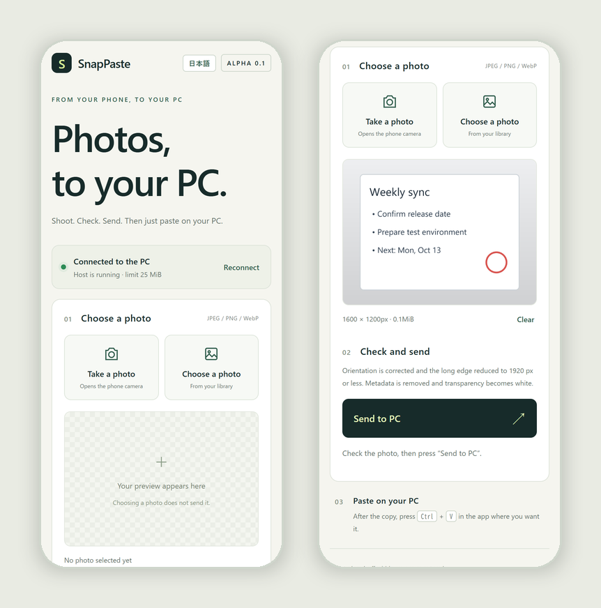

# SnapPaste

[](https://github.com/anpanmanj987-hub/SnapPaste/actions/workflows/ci.yml)
[](LICENSE)


**Shoot. Check. Send. Then `Ctrl+V` on your PC.**

SnapPaste sends a photo from your phone straight to the clipboard of a Windows PC on the same Wi-Fi. Snap a whiteboard, a note or a document and paste it into PowerPoint or a chat a second later, without emailing yourself or going through cloud storage.

[日本語 README](README.md)




## Features

- **No phone app**: scan the QR code shown on the PC and use the browser.
- **Preview first**: choosing a photo never sends it. Check the preview, then press Send.
- **Ready to paste**: EXIF orientation is applied, the long edge is reduced to 1920 px, and transparency becomes white.
- **No location data left behind**: the image is rebuilt from its pixels, so EXIF, GPS, XMP and ICC metadata never reach the pasted image.
- **English and Japanese**: the page follows your browser language and the terminal follows the PC's language (set `SNAPPASTE_LANG=en` or `ja` to choose); the page also has a toggle.
- **Stays local**: nothing goes to external services, and by default nothing is written to disk.

## Quick start

Requires Windows 10/11 and Python 3.10 or newer. In PowerShell:

```powershell
py -m venv snappaste-env
snappaste-env\Scripts\python -m pip install https://github.com/anpanmanj987-hub/SnapPaste/archive/refs/tags/v0.1.0a5.zip
snappaste-env\Scripts\python -m snappaste --host 192.168.1.20
```

Replace `192.168.1.20` with your PC's address (the "IPv4 Address" line of `ipconfig`). A QR code appears in the terminal; scan it with a phone on the same Wi-Fi.

1. Take a photo or pick one from the library, and check the preview.
2. Press "Send to PC".
3. When the page says the image was copied, press `Ctrl+V` in the PC app where you want it.

`Ctrl+C` stops the host. The QR code and join URL carry a secret token valid only while this host runs; do not share them. Restarting changes the token.

To listen on all interfaces, also give the address to put in the QR code:

```powershell
snappaste-env\Scripts\python -m snappaste --host 0.0.0.0 --advertise 192.168.1.20
```

### If it does not connect

- Make sure the PC and phone are on the same network. Guest Wi-Fi client isolation and VPNs block the connection.
- If Windows Firewall asks, allow incoming connections on private networks.
- Windows does not let apps use the clipboard while the PC is locked. Unlock it and send again.

## Formats and limits

- JPEG, PNG and still WebP. Convert HEIC to JPEG first (iPhone Safari normally converts on upload).
- Up to 25 MiB and 50 megapixels per upload. Small images are never enlarged.
- `--max-edge` (output long edge, up to 8192 px), `--max-mib` and `--max-pixels` change the limits; upload size and input pixels cannot exceed the values above.
- ICC profiles are dropped rather than converted, so wide-gamut photos may shift in color.

## Trying it without Windows

On macOS and Linux, start with `--dry-run`. It transfers, orients, resizes and builds the clipboard data, but never updates a clipboard or saves the image.

```sh
python3 -m venv snappaste-env
snappaste-env/bin/python -m pip install https://github.com/anpanmanj987-hub/SnapPaste/archive/refs/tags/v0.1.0a5.zip
snappaste-env/bin/python -m snappaste --dry-run
```

## Security

- Traffic is unencrypted HTTP. Use SnapPaste on trusted networks such as your home Wi-Fi and never expose the port to the internet.
- Besides the per-launch token, Host and Origin are checked exactly. One image is processed at a time, with at most eight connections.
- The original photo, metadata included, travels to the PC and is stripped there.

## Verification status

- **Automated tests**: 59 cases, run by GitHub Actions on Windows, macOS and Linux with Python 3.10, 3.12 and 3.14.
- **Real Windows**: on 2026-10-06 on Windows 11, a photo sent over HTTP landed on the clipboard with its orientation applied; another app (.NET) read the same image after SnapPaste had exited; and while the PC was locked, SnapPaste reported a failure instead of success.
- **Not yet verified**: sending from a real phone over a LAN, and pasting into specific apps such as Paint, Word or PowerPoint.

See the [validation record](docs/VALIDATION.md) and [design notes](docs/DESIGN.md).

## Development

```sh
git clone https://github.com/anpanmanj987-hub/SnapPaste.git
cd SnapPaste
python -m pip install -e .
python -m unittest discover -s tests -v
```

Bug reports and ideas are welcome in [Issues](https://github.com/anpanmanj987-hub/SnapPaste/issues). See the [changelog](CHANGELOG.md).

## License

[MIT](LICENSE)
