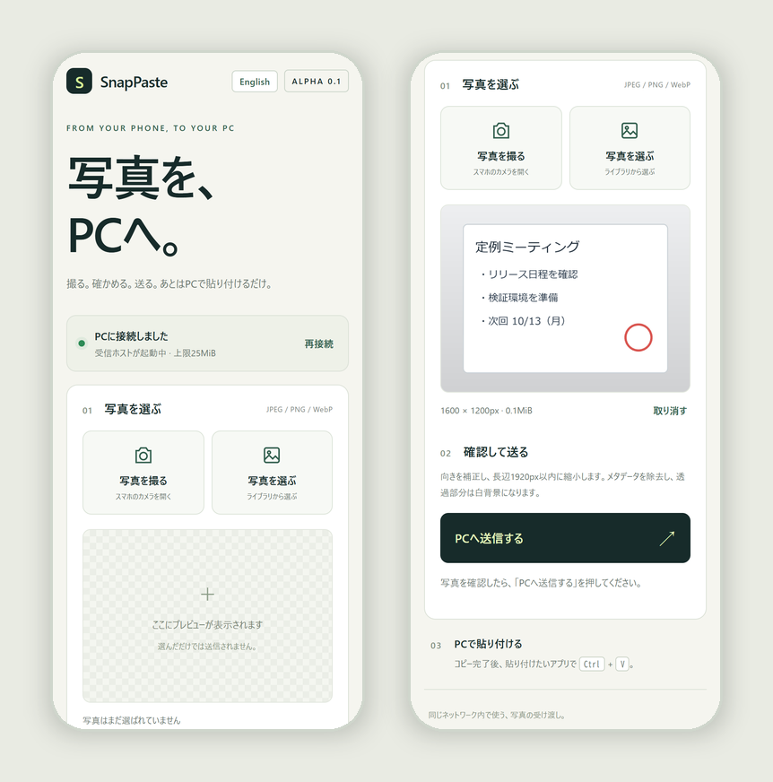

# SnapPaste

[](https://github.com/anpanmanj987-hub/SnapPaste/actions/workflows/ci.yml)
[](LICENSE)


**撮る。確かめる。送る。あとはPCで `Ctrl+V`。**

SnapPaste は、スマホで撮った写真やライブラリの画像を、同じWi-FiにあるWindows PCのクリップボードへ直接送るツールです。ホワイトボードやメモ、書類を撮って、そのままPowerPointやチャットに貼り付けられます。メールや自分宛てのチャット、クラウドストレージを経由する必要はありません。

[English README](README.en.md)



## 特長

- **スマホにアプリ不要**：PCに表示されるQRコードを読み取れば、ブラウザからすぐ使えます。
- **送る前に確認**：写真を選んだだけでは送信されません。プレビューを見てから「PCへ送信する」を押します。
- **貼り付けやすく整える**：撮影時の向き（EXIF）を反映し、長辺1920pxまでに縮小します。透過部分は白背景になります。
- **位置情報などを残さない**：画素から画像を作り直すため、EXIF・GPS・XMP・ICCなどのメタデータは貼り付ける画像に含まれません。
- **日本語と英語に対応**：画面はブラウザの言語に、ターミナルの表示はPCの言語設定に合わせます。画面右上のボタンでも切り替えられます。
- **ローカルで完結**：外部サービスには送りません。既定では画像をディスクにも保存しません。

## クイックスタート

Windows 10/11 と Python 3.10 以上が必要です。PowerShell で実行します。

```powershell
py -m venv snappaste-env
snappaste-env\Scripts\python -m pip install https://github.com/anpanmanj987-hub/SnapPaste/archive/refs/tags/v0.1.0a5.zip
snappaste-env\Scripts\python -m snappaste --host 192.168.1.20
```

`192.168.1.20` は例です。`ipconfig` の「IPv4 アドレス」に表示される、自分のPCのアドレスに置き換えてください。ターミナルにQRコードが表示されるので、同じWi-Fiにつないだスマホで読み取ります。

1. 「写真を撮る」か「写真を選ぶ」で画像を選び、プレビューを確認します。
2. 「PCへ送信する」を押します。
3. 「PCのクリップボードに画像をコピーしました」と表示されたら、PCの貼り付けたいアプリで `Ctrl+V` を押します。

終了は `Ctrl+C` です。QRコードと参加URLにはこの起動中だけ有効な秘密のトークンが含まれるので、他人には共有しないでください。再起動するとトークンは変わります。

すべてのインターフェイスで待ち受ける場合は、QRコードに載せるアドレスも指定します。

```powershell
snappaste-env\Scripts\python -m snappaste --host 0.0.0.0 --advertise 192.168.1.20
```

### うまくつながらないとき

- PCとスマホが同じネットワークにあるか確認してください。ゲストWi-Fiの端末間通信の制限やVPNがあると届きません。
- Windowsファイアウォールの確認が出たら、プライベートネットワークでの受信を許可してください。
- PCがロック中のときは、Windowsの仕様でクリップボードにコピーできません。ロックを解除してから送り直してください。

## 対応する画像と上限

- JPEG、PNG、静止画のWebPに対応しています。HEICはJPEGに変換してから送ってください（iPhoneのSafariは通常、送信時にJPEGへ変換します）。
- 受け付けるのは25 MiBまで、5000万画素までです。小さい画像は拡大しません。
- `--max-edge`（縮小後の長辺、最大8192px）、`--max-mib`、`--max-pixels` で変更できます。受信容量と入力画素数は上の値より大きくはできません。
- 元画像のICCプロファイルは変換せずに取り除くため、広色域の写真では色味が変わることがあります。

## 動作確認モード（Windows以外）

macOS・Linuxでは `--dry-run` を付けて起動します。転送・向きの補正・縮小・クリップボード用データの生成までを行いますが、クリップボードは更新せず、画像も保存しません。

```sh
python3 -m venv snappaste-env
snappaste-env/bin/python -m pip install https://github.com/anpanmanj987-hub/SnapPaste/archive/refs/tags/v0.1.0a5.zip
snappaste-env/bin/python -m snappaste --dry-run
```

## セキュリティ

- 通信は暗号化されないHTTPです。家庭内など信頼できるネットワークだけで使い、ポートをインターネットに公開しないでください。
- 起動ごとのトークンに加えて、HostとOriginを厳密に確認します。画像の処理は同時に1件、接続は最大8件までです。
- 元の写真は（メタデータを含めて）PCまで送られ、PC側で取り除かれます。

## 動作確認の状況

- **自動テスト**：59件。GitHub ActionsでWindows・macOS・Linux × Python 3.10 / 3.12 / 3.14 を実行しています。
- **Windows実機**：2026年10月6日に Windows 11 で、HTTPで送った写真が向きを補正された状態でクリップボードに入ること、SnapPasteを終了した後も別のアプリ（.NET）から同じ画像を読み出せること、PCのロック中は成功と表示せずに失敗を返すことを確認しました。
- **未確認**：実際のスマートフォンからLAN経由で送る操作、Paint・Word・PowerPointなど個別のアプリへの貼り付け。

詳しくは [検証記録](docs/VALIDATION.md) と [設計メモ](docs/DESIGN.md) を参照してください。

## 開発

```sh
git clone https://github.com/anpanmanj987-hub/SnapPaste.git
cd SnapPaste
python -m pip install -e .
python -m unittest discover -s tests -v
```

不具合の報告や改善の提案は [Issues](https://github.com/anpanmanj987-hub/SnapPaste/issues) へお願いします。変更履歴は [CHANGELOG](CHANGELOG.md) にあります。

## ライセンス

[MIT](LICENSE)
